# 전시회 감상 일지.

3,4월에 방문한 전시회 후기를 웹사이트 형식으로 공유한 프로젝트.

[project #7 링크](https://chocho030.github.io/project-seven/)

## 기획

메인 페이지에서 다녀온 3개의 전시회가 노출되어있다. 각각 전시회 페이지로 이동하면 전시회에 대한 간단한 설명과 전시 작품들을 볼 수 있다.

### 메인페이지

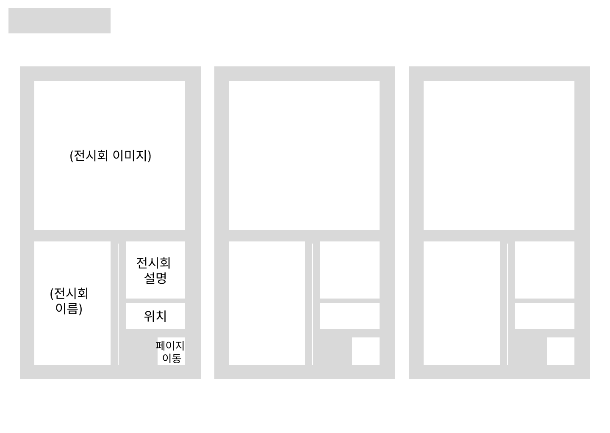

왼쪽 상단에 프로젝트명을 기입한다.
3개 구역으로 분류하여 각각 전시회에 대한 간단한 설명을 기입한다.
각 구역을 클릭시 전시회 페이지로 이동한다.

### 전시회 페이지

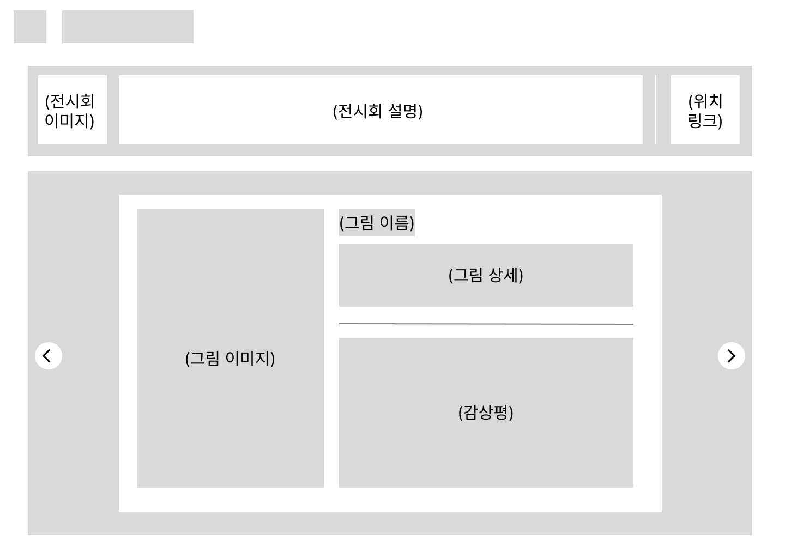

왼쪽 상단에 메인 페이지로 이동할 수 있는 홈 버튼과 페이지 이름을 삽입한다.
네비게이션 아래 부분에 전시회 대표 이미지와 전시회에 대한 간단한 설명, 그리고 전시회 위치 링크를 삽입한다.
하단부의 양 끝에 페이지 이동을 할 수 있는 버튼을 삽임한다.
하단부의 중앙 왼쪽에 그림 이미지를 크게 삽입한다.
하단부의 중앙 오른쪽에 그림 이름과 상세를 기입하고 상세 아래에 선으로 구역을 분리한 뒤, 아랫부분에 감상평을 기입한다.

## 구현

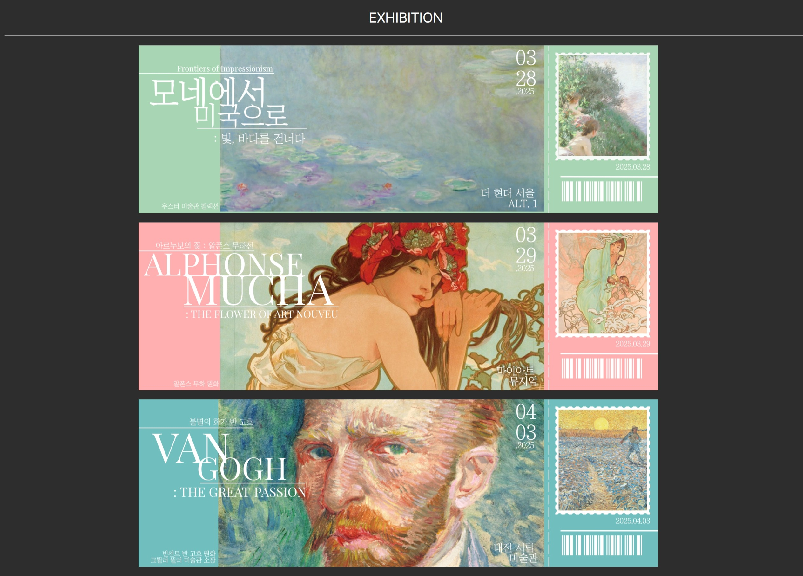
3개의 전시회 페이지로 이동하는 링크를 삽입했다. 전시회라는 소재의 특수성을 살려 링크를 티켓 모양 이미지로 첨부하였으며, 페이지 이동 시 티켓을 자르는 듯한 간단한 애니메이션 효과가 나오도록 하였다.

| 구분     | 인상주의파                           | 무하                               | 반 고흐                           |
| -------- | ------------------------------------ | ---------------------------------- | --------------------------------- |
| 첫페이지 | 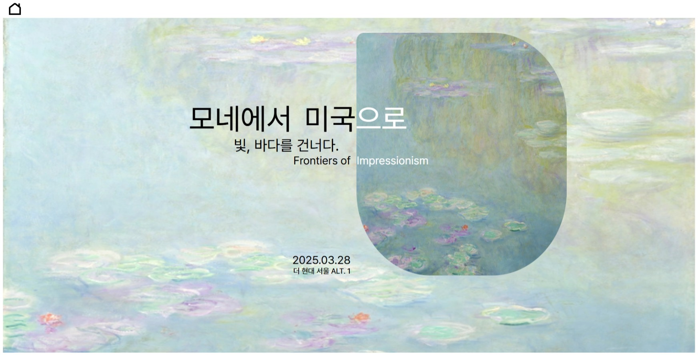 | 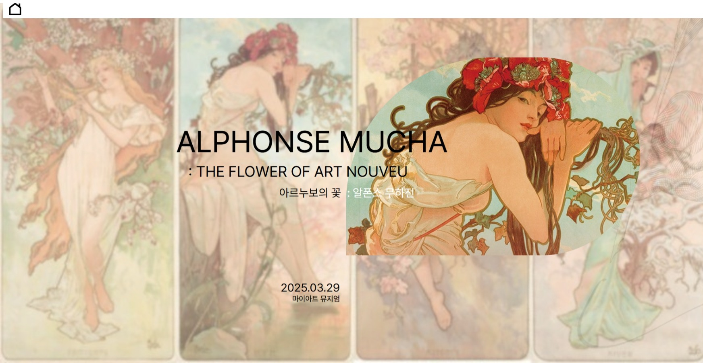 | 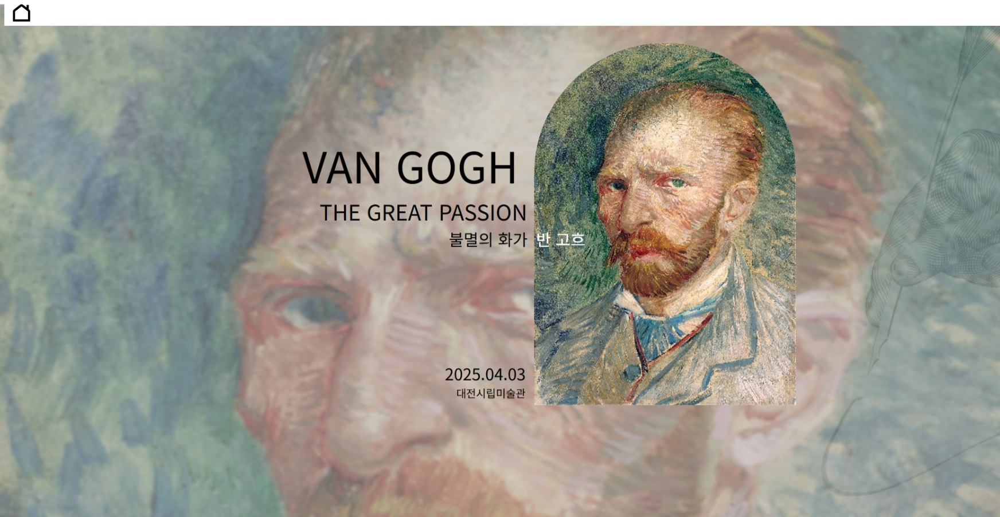 |

각 전시회의 전시장소, 대표작 등의 간단한 정보를 삽입하였다. 클릭 시, 섹션 페이지로 이동한다. 링크는 편의성을 위해 페이지 전체 범위로 걸어두었다.

| 구분 | 인상주의파                                   | 무하                                       | 반 고흐                                   |
| ---- | -------------------------------------------- | ------------------------------------------ | ----------------------------------------- |
| 섹션 | 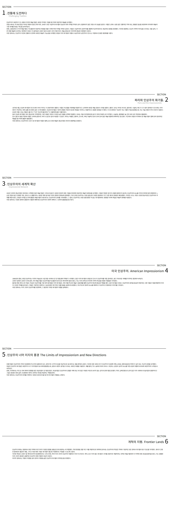 | 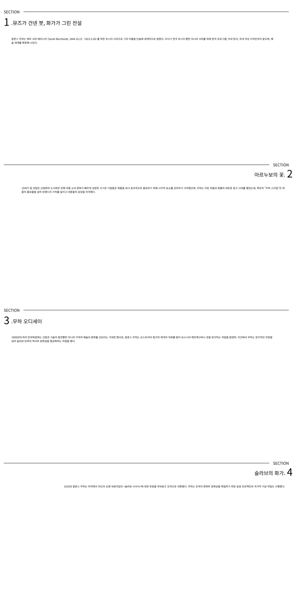 | 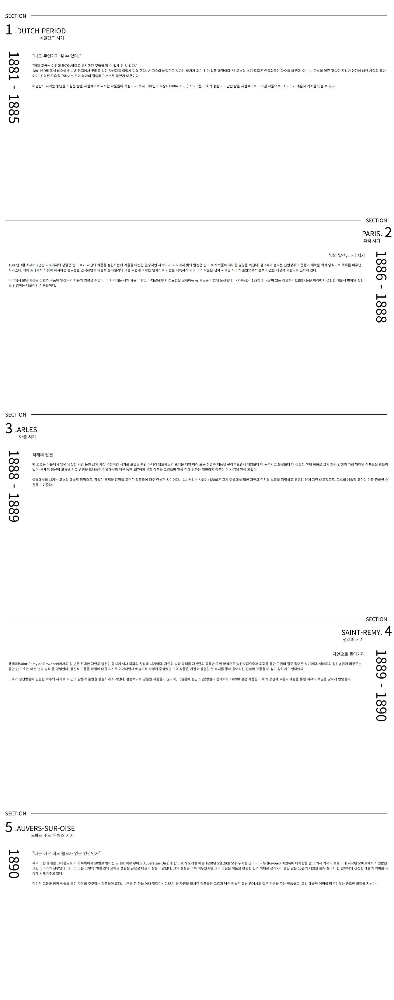 |

전시회 섹션에 대한 간단한 정보가 삽입되어 있는 페이지이다. 각 섹션의 설명 부분을 클릭 시, 관련 섹션의 작품 리뷰 페이지로 이동한다.

| 구분 | 인상주의파                                  | 무하                                      | 반 고흐                                  |
| ---- | ------------------------------------------- | ----------------------------------------- | ---------------------------------------- |
| 리뷰 | 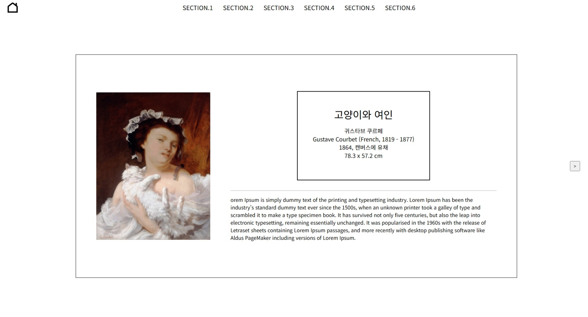 | 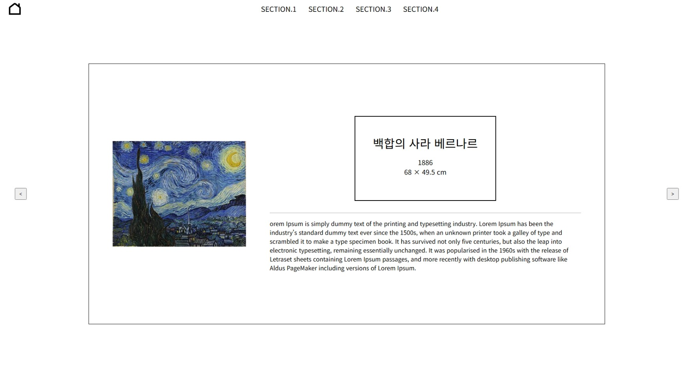 | 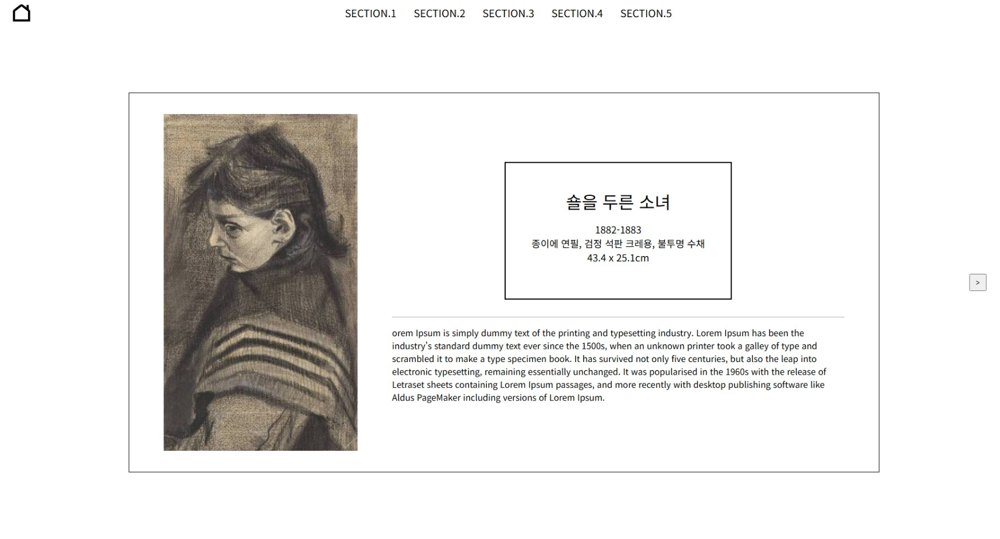 |

전시회 작품에 대한 간단한 정보와 리뷰가 삽입되어 있는 페이지이다. 화면 상단부에는 네비게이션이 존재하여 이전 페이지인 섹션 페이지나 다른 섹션의 리뷰 페이지로 바로 이동할 수 있다. 화면 중앙부 양 끝 부분에는 페이지 이동 버튼이 있다. 현재 섹션의 마지막 작품까지 모두 관람 시, 섹션 페이지의 다음 섹션 설명 부분으로 이동한다.

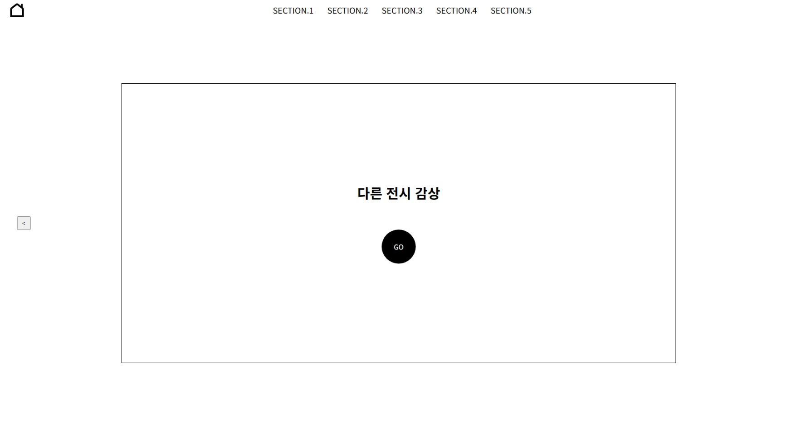

## 임펙트

사이트 방문자들의 흥미를 끌어내기 위해 맨 첫 페이지 티켓 부분에 간단한 애니메이션을 삽입하였다.
실제 전시회와 같은 느낌을 주기 위하여 섹션의 설명을 읽고 세부 작품의 리뷰를 감상한 뒤 다음 섹션의 설명으로 이동하는 구조로 구상하였다.
