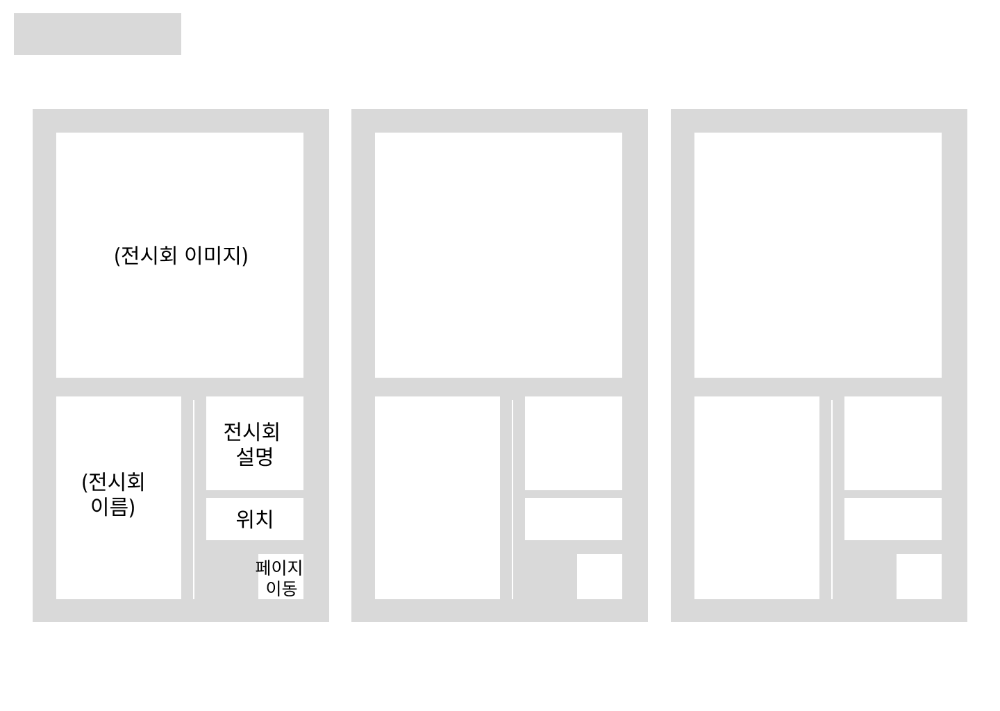
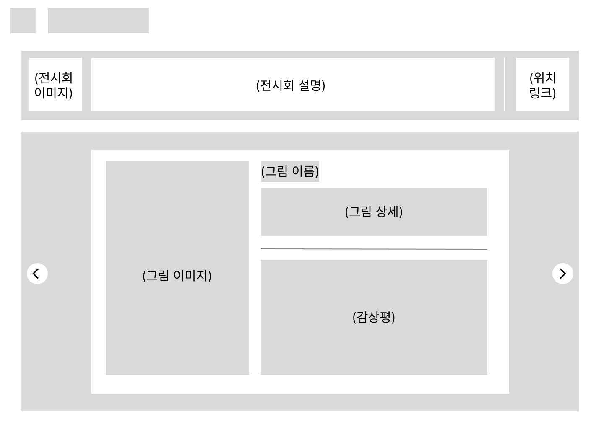

# 전시회 감상 일지.

3,4월에 방문한 전시회 후기를 웹사이트 형식으로 공유한 프로젝트.

## 기획

메인 페이지에서 다녀온 3개의 전시회가 노출되어있다. 각각 전시회 페이지로 이동하면 전시회에 대한 간단한 설명과 전시 작품들을 볼 수 있다.

### 메인페이지

왼쪽 상단에 프로젝트명을 기입한다.
3개 구역으로 분류하여 각각 전시회에 대한 간단한 설명을 기입한다.
각 구역을 클릭시 전시회 페이지로 이동한다.

### 전시회 페이지

왼쪽 상단에 메인 페이지로 이동할 수 있는 홈 버튼과 페이지 이름을 삽입한다.
네비게이션 아래 부분에 전시회 대표 이미지와 전시회에 대한 간단한 설명, 그리고 전시회 위치 링크를 삽입한다.
하단부의 양 끝에 페이지 이동을 할 수 있는 버튼을 삽임한다.
하단부의 중앙 왼쪽에 그림 이미지를 크게 삽입한다.
하단부의 중앙 오른쪽에 그림 이름과 상세를 기입하고 상세 아래에 선으로 구역을 분리한 뒤, 아랫부분에 감상평을 기입한다.
